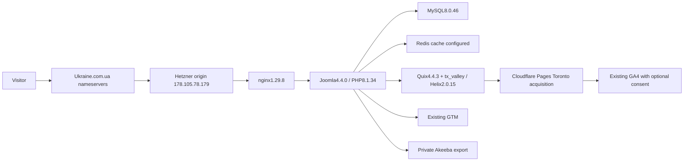

# PsiTrends architecture

Verified2026-09-22. Current production is a database-driven Joomla installation, not a Git-deployed sales landing.

Origin label`ubuntu-16gb-fsn1-1`, document root`/var/www/html`. Container/compose definitions, OS patch level, volume mounts, cron and TLS automation require recovered host access. Do not infer an operating system version from the server label. Redis is a configuration finding; server topology and persistence not yet inspected.

## Application inventory

The private archive contains104 database tables; the sanitized [CMS inventory](../.codex/reports/2026-09-22/psitrends-evidence/cms-inventory.json) contains menu trees, modules/positions/assignments, languages, style IDs, override paths and content IDs. The [extension inventory](../.codex/reports/2026-09-22/psitrends-evidence/extensions.json) covers278 installed extension records.

-141 Quix page records,107 published;50 Joomla articles;216 menu records,183 site records;10 menu types;56 modules before the rollback probe.
-10 template styles. tx_valley17 is English default,21 Russian default;15 fallback. Core administrator style10 Atum. Other installed styles include Cassiopeia, Atom and esitemplate; installation does not prove use.
-English`en-GB`, Russian`ru-RU`. Homepage menu202→Quix4; Russian menu204→Quix141. All-language home101→Quix2. Multiple published old/demo homepages are candidates for review, not automatic deletion.
-109 template override DB records; filesystem paths separately inventoried. Dashboard reports50 override update notices. Compare each against updated core before migration.
-Joomla scheduler0 tasks. Host cron and Akeeba automation not known. Previous backup dates do not establish a working schedule.
-Two administrator accounts are Super Users;0 MFA enrollments in the baseline. Usernames/emails excluded. Registration disabled. Session lifetime6400minutes is excessive for administrator exposure; change only after recovery and supported config writes.
-Cache: Joomla caching1/Redis plus JCH Optimize8.1.1, LiteSpeed Cache1.5.1 and ImageRecycle2.1.2. Do not enable more cache layers; test redundant plugins on staging first.

## Customization and integrations

- Module129: Toronto English navigation, `content-top`, two existing acquisition URLs, documented source in`integrations/joomla/toronto-navigation.html`.
- Helix custom JS styles17/21: `integrations/joomla/toronto-attribution.js`, copies only approved GBP UTM values to acquisition links. Do not blanket-copy query strings.
- GA4`G-Z4BGV9GP4N`, GTM`GTM-K2KKDZD`; existing account/property IDs in analytics runbook are public identifiers, not credentials.
- Contact mechanisms: Telegram, WhatsApp, external Google Forms, Google Maps; YouTube embeds and social profiles. Forms are not equivalent to verified qualified enquiries. No messages were sent.
- DNS: three inhostedns nameservers, Ukraine.com.ua MX/SPF; no observedAAAA/CAA. DNS ownership and mail deliverability are not inferred from these records.
- HTTPS redirect paths work. Public robots exists; root sitemap404. No server-rendered canonical across the crawl; rendered-page checks and migration gates remain mandatory.

## Durable source arrangement

Keep sanitized operations docs and integration source in`sales`. Private full archive, exports, original configuration and restore clone stay under the private operations directory. The actual production source includes files AND database state; a static mirror is not a recoverable Joomla source.

After hosting recovery, inventory the live compose/image/volume configuration and locate any existing private origin repository. If none exists, establish a private `psitrends-ops` repository for sanitized infrastructure definitions and migration scripts, link it here, and keep encrypted data backups outside Git. Do not create it speculatively before the real deploy contract is known.
