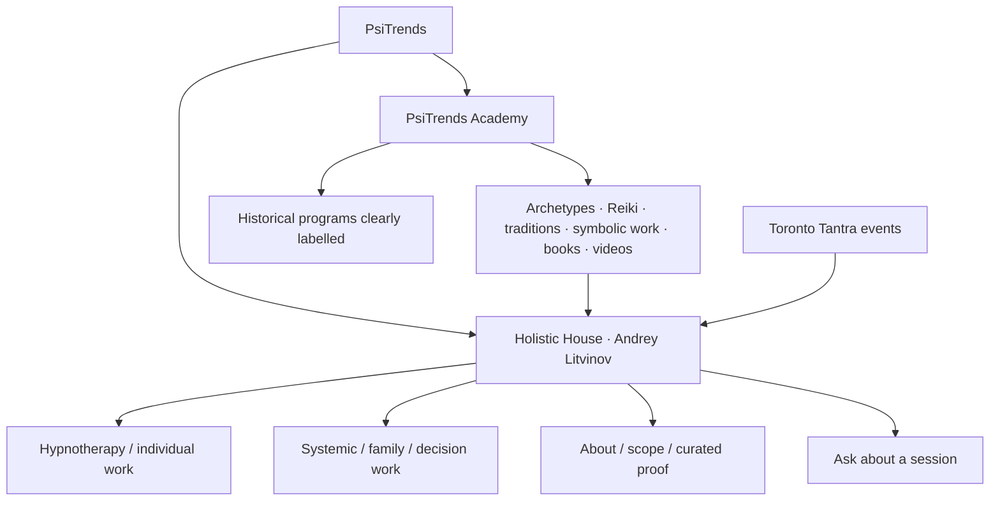

# PsiTrends content map and target architecture

This is the implementation specification; the broad rebuild has not been released. Preserve current URLs until Search Console data and ownership facts support consolidation.

## Inventory

See the dated evidence files: `url-content-inventory.csv` (178 tested URLs), `cms-inventory.json` (all saved menu/module/Quix/article records), `claims-title-audit.csv` (literal EN/RU matches with exact phrase/context/action), and `crawl.json`. The crawl includes CMS menu seeds and all discovered internal non-query links; queue exhausted. Public routes and CMS records are complementary. An unpublished or unlinked record is not automatically safe to delete.

Inventory actions are conservative proposals: KEEP/UPDATE for existing content; one verified301 for`/express-ru`; no mass deletion, no new keyword pages. Titles/prices/credentials/testimonials remain unverified where evidence is missing. Claim matches require context review; educational mention is not automatically a prohibited title claim.

## One recommended brand structure

PsiTrends is the umbrella domain and knowledge platform. **Holistic House · Andrey Litvinov** is the client-practice identity connected to the existing GBP. **PsiTrends Academy** labels the library/education area. Toronto Tantra remains a separate events/community funnel, with contextual links only. No new brand is needed.

Use six primary items initially; Business remains within Constellations until demand and actual service availability justify its own page:

| EN navigation | RU navigation | Proposed route |
|---|---|---|
| Home | Главная | `/`, `/ru/` |
| Hypnotherapy | Гипноз и индивидуальная работа | `/hypnotherapy-toronto`, deliberate RU equivalent after copy review |
| Constellations | Системные расстановки | `/systemic-constellations-toronto`, deliberate RU equivalent |
| About Andrey | Об Андрее | `/about`, `/ru/about` |
| Academy | Академия | `/academy`, `/ru/academy` |
| Contact | Контакты | `/contact`, `/ru/contact` |

## URL migration decisions

| Current | Future/action | Gate |
|---|---|---|
| `/` and `/ru/` | UPDATE in place | Keep locale behavior deliberate; no forced wholesale language parity |
| `/therapy/image-psychotherapy` | Candidate MERGE into first-party hypnotherapy | Review GSC/backlinks, remove title/claims risk, preserve useful content, then301 |
| Existing Cloudflare hypnotherapy page | Candidate301 to`/hypnotherapy-toronto` | First-party page live, canonical/indexable, consent/CTA regression passed |
| Existing Cloudflare constellations page | Candidate301 to`/systemic-constellations-toronto` | Same release gate; preserveGBP UTM |
| `/express` and `/ru/express-ru` | UPDATE enquiry wording; possible later contact merge | Verify actual offer/free-diagnostic availability and traffic first |
| `/express-ru` |301→`/ru/express-ru` | Executed as exact broken locale repair |
| Business/legacy service pages | KEEP/UPDATE; possible contextual constellation link | No growth promises; dedicated new business page deferred pending demand |
| Reiki/mysteries/artifacts/studies | EDUCATIONAL RESOURCE or CLAIM REVIEW | Classify actual current vs historical offers; retain authority |
| Demo/duplicate published Quix pages | Review/noindex candidate | Confirm no useful traffic/inlinks and exact routing before changing |
| Any404 without exact equivalent | Investigate source link | Never redirect unrelated errors to homepage |

The CSV provides the full per-URL provisional action/target/owner/status. No final redirect map is approved solely on visual age. New GSC property is still processing; authority evidence is unavailable.

## Implementation-ready homepage copy

Hero H1: **Hypnotherapy and Systemic Constellations in Toronto**

Supporting copy: “Explore repeating patterns, inner conflicts and important decisions with Andrey Litvinov. Individual sessions combine conversation and experiential work, with methods chosen together for your situation.”

Identity: “Holistic House · Andrey Litvinov · Toronto and online.” Primary CTA: **Ask about a session**. Secondary anchor: **How sessions work**. Reuse the verified contact destination; do not invent a booking calendar.

Client situations: “You know what you want, but keep hesitating.” “A relationship or decision pattern keeps repeating.” “You want space to explore conflicting priorities.” Avoid diagnoses as acquisition promises.

Four steps: **Map your question** (goals, context and boundaries); **Explore the pattern** (roles, needs and perspectives); **Choose the experiential work** (hypnosis, parts work or systemic mapping where appropriate); **Integrate** (reflect and identify a practical next step). Optional symbolic mandala/artifact work is an agreed add-on, not a required result.

Service cards: Hypnotherapy—“Guided attention and imagery to explore inner patterns.” Constellations—“Experiential mapping of relationships, roles and choices.” Business/decision work—“Explore a decision or organizational question from different perspectives.” Third card links to a section/enquiry until a dedicated offer is verified.

Expectations: “You can ask questions, pause or decline any exercise. Experiences and outcomes vary. Discuss suitability before booking; these sessions do not replace necessary medical or mental-health care.” Do not use this paragraph to justify treatment claims elsewhere.

Proof: three consented examples about the process, not screenshots promising cures/income. Until consent/source verified, omit unverified testimonial blocks. About teaser leads to accurate training and scope. Academy gateway: “Explore the methods, books and learning archive.” Final CTA repeats **Ask about a session**.

## Service page specifications

### Hypnotherapy

Intent: Toronto hypnosis/hypnotherapy, preserving the real Maps acquisition signal. H1 **Hypnotherapy in Toronto**. Intro: “A guided, collaborative way to explore patterns, goals and inner responses. Ask Andrey about fit, format and availability.” Use the existing reviewed Toronto page as the content baseline rather than creating a near-duplicate.

Sections: what hypnosis means here; voluntary participation; systemic mapping/parts work options; four-step session flow; practical Toronto/online format; scope; FAQ; primary enquiry CTA. FAQ answers: no loss-of-control promise; client can pause; no guaranteed number of sessions; suitability discussed individually; fees/duration supplied only after current factual confirmation. Metadata: “Hypnotherapy Toronto | Andrey Litvinov · Holistic House”. Description: “Explore individual hypnotherapy sessions in Toronto or online. Learn how sessions work and ask Andrey Litvinov about suitability, availability and fees.”

### Systemic / family constellations

H1 **Systemic Constellations in Toronto**. Intro: “Explore a relationship, family pattern or important decision through experiential systemic mapping.” Explain individual vs group format only where actually offered. State that an exercise does not establish factual truths about absent people or family history. Explain consent, interpretation, reflection and integration. FAQ: who attends; voluntary participation; no diagnosis; no guaranteed family change; format/fees verified before booking. Metadata: “Systemic & Family Constellations Toronto | Holistic House”. CTA **Ask about a constellation session**.

### Business / decision work

Dedicated page deferred: existing content proves service history, not current search demand or availability. Section copy: “Map roles, competing priorities and possible perspectives around a business decision. Use the session as reflection alongside your own practical research and professional advice.” No guaranteed growth, investment/legal advice or revenue percentages.

### About / contact

About H1 **About Andrey Litvinov**. Separate completed education, modality training and current practice. Publish qualification names/dates only from verified documents; no Canadian equivalence or protected professional title inferred. Toronto/online context and voluntary experiential scope must be explicit.

Contact H1 **Ask about a session**. Lead: “Tell us the type of session you are considering, whether you prefer Toronto or online, and a good way to reply. Please avoid sending sensitive health details in your first message.” Use current verified WhatsApp with Telegram fallback. State response expectations only after operational verification. Fees, duration, address eligibility and cancellation terms are factual gates; do not fill them with invented copy.

### Academy hub

Taxonomy: Archetypes; Constellations; Reiki/energy traditions; Mysteries/traditions; Mandalas/artifacts; Books; Videos; Historical programs. Every page labelled CURRENT OFFER, EDUCATIONAL RESOURCE, HISTORICAL PROGRAM, CLAIM REVIEW or MERGE candidate. Historical pages retain useful content but lose stale active-offer CTAs after owner availability verification. Add one relevant current-service link per useful article.
